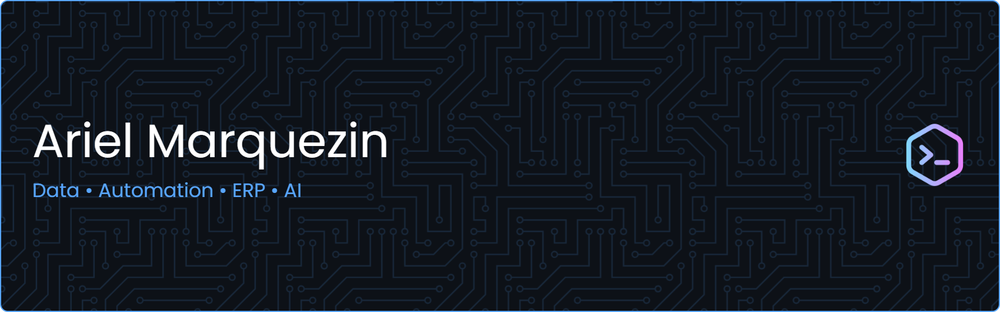

  

## Stacks

| Categoria | Tecnologias |
|------------|------------|
| Linguagens |    |
| Bancos de Dados |   |
| Bibliotecas |     |
| Power Platform |    |
| ERP |   |
| Cloud & Identidade |  |
| Integrações |   |
| Documentação |  |
| IA |     |
| Domínio de Negócio |    |
| Versionamento |   |
| Certificações |  |
